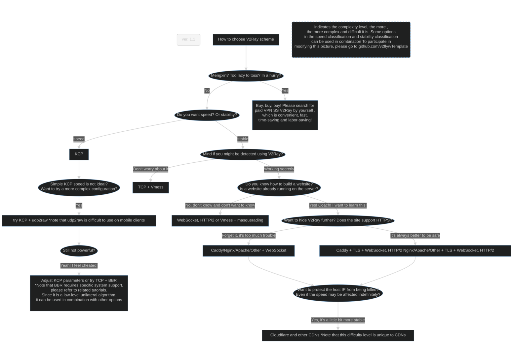

# How to choose a V2Ray solution



## Want to participate in modifying this picture?

1. Modify [how-to-choose-a-v2ray-plan](how-to-choose-a-v2ray-plan.mmd) (see [Mermaid flowchart syntax](https://mermaidjs.github.io/how-to-choose-a-v2ray-plan.html))
1. Generate PNG and overwrite the existing `how-to-choose-a-v2ray-plan.png` file
   1. Install [mermaid.cli](https://github.com/mermaidjs/mermaid.cli)
      ```shell
      # yarn config set puppeteer_download_host https://npm.taobao.org/mirrors
      yarn add mermaid.cli
      ````
      Or use NPM:
      ````
      # npm config set puppeteer_download_host=https://npm.taobao.org/mirrors
      npm install mermaid.cli
      ````
   1. Generate files
      ```shell
      ./node_modules/.bin/mmdc -i how-to-choose-a-v2ray-plan.mmd -o how-to-choose-a-v2ray-plan.png -t forest -C style.css -w 1920 - H 1080 -p puppeteer-config.json
      ````
1. Submit PR

## Related Links

[Online Preview Mermaid](https://mermaidjs.github.io/mermaid-live-editor/)
[Online Markdown editor with Mermaid support](https://mdp.tylingsoft.com/)
[mermaid](https://github.com/knsv/mermaid)
